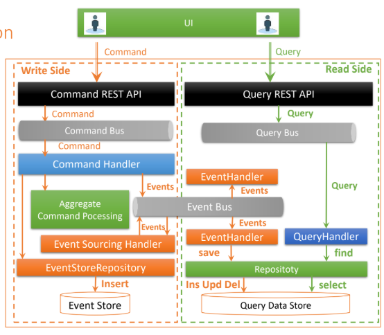
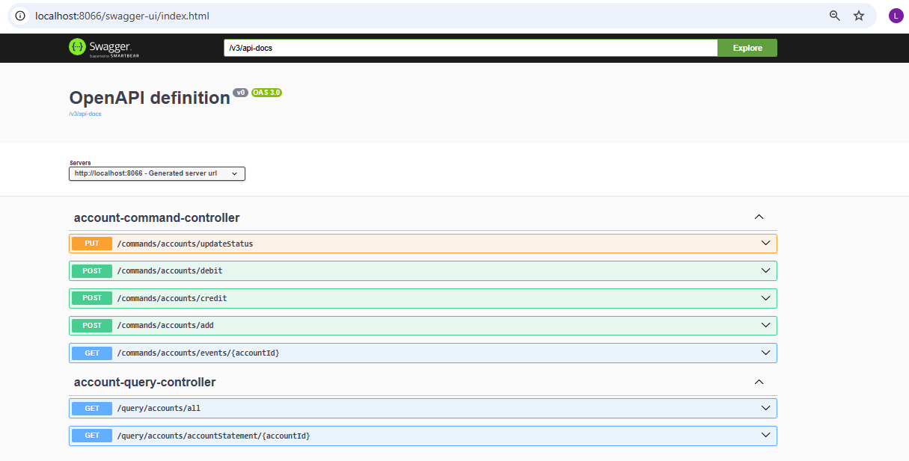

# Event Sourcing CQRS avec Axon Framework

Application bancaire implémentant les patterns **Event Sourcing** et **CQRS** avec Axon Framework et Spring Boot.

## 📋 Table des Matières

- [Vue d'Ensemble](#vue-densemble)
- [Technologies](#technologies)
- [Architecture](#architecture)
- [Structure du Projet](#structure-du-projet)
- [Installation](#installation)
- [Configuration](#configuration)
- [API Endpoints](#api-endpoints)
- [Modèle de Domaine](#modèle-de-domaine)
- [Flux de Données](#flux-de-données)
- [Architecture CQRS Détaillée](#architecture-cqrs-détaillée)
- [Règles Métier](#règles-métier)


## 🎯 Vue d'Ensemble

Cette application permet de gérer des comptes bancaires avec une séparation complète entre les opérations d'écriture (Command) et de lecture (Query).

### Opérations Command (Écriture)
- ✅ Création de compte avec solde initial
- ✅ Crédit de compte
- ✅ Débit de compte
- ✅ Changement de statut de compte
- ✅ Consultation de l'historique d'événements

### Opérations Query (Lecture)
- ✅ Liste de tous les comptes
- ✅ Relevé de compte avec historique des opérations
- ✅ Projections optimisées pour la lecture

### Patterns Implémentés

**Event Sourcing**
- Tous les changements d'état sont stockés comme événements immuables
- L'état actuel est reconstruit en rejouant les événements
- Traçabilité et auditabilité complètes

**CQRS (Command Query Responsibility Segregation)**
- Séparation complète entre commandes (écriture) et requêtes (lecture)
- Modèles de données différents pour Command et Query
- Architecture orientée événements
- Scalabilité et performance optimisées

**Domain-Driven Design (DDD)**
- Agrégats pour encapsuler la logique métier
- Validation des règles métier au niveau de l'agrégat

## 🛠️ Technologies

### Framework Principal
- **Spring Boot** 3.3.4
- **Java** 21
- **Axon Framework** 4.12.2

### Base de Données
- **PostgreSQL** (production)
- **H2** (développement/test)

### Dépendances
- Spring Data JPA
- Lombok
- SpringDoc OpenAPI / Swagger UI
- Spring Web MVC

## 🏗️ Architecture

### Architecture CQRS Complète



## 📁 Structure du Projet

```
src/main/java/org/example/eventsourcingcqrsspringbootaxon/
│
├── command/                              # WRITE SIDE (CQRS)
│   ├── aggregate/
│   │   └── AccountAggregate.java         # Agrégat principal
│   │
│   ├── command/
│   │   ├── AddAccountCommand.java        # Commandes
│   │   ├── CreditAccountCommand.java
│   │   ├── DebitAccountCommand.java
│   │   └── UpdateAccountStatusCommand.java
│   │
│   ├── controller/
│   │   └── AccountCommandController.java # API REST Command
│   │
│   └── dto/
│       ├── AddNewAccountRequestDTO.java  # DTOs Command
│       ├── CreditAccountRequestDTO.java
│       ├── DebitAccountRequestDTO.java
│       └── UpdateAccountStatusRequestDTO.java
│
├── query/                                # READ SIDE (CQRS)
│   ├── controller/
│   │   └── AccountQueryController.java   # API REST Query
│   │
│   ├── dto/
│   │   └── AccountStatementResponseDTO.java # DTOs Query
│   │
│   ├── entity/
│   │   ├── Account.java                  # Entité JPA Account
│   │   ├── AccountOperation.java         # Entité JPA Operation
│   │   └── OperationType.java            # Enum (DEBIT/CREDIT)
│   │
│   ├── handler/
│   │   ├── AccountEventHandler.java      # Gestion événements → DB
│   │   └── AccountQueryHandler.java      # Gestion requêtes
│   │
│   ├── query/
│   │   ├── GetAllAccountsQuery.java      # Requêtes Query
│   │   └── GetAccountStatementQuery.java
│   │
│   └── repository/
│       ├── AccountRepository.java        # JPA Repository
│       └── OperationRepository.java
│
├── events/                               # SHARED (Command & Query)
│   ├── AccountCreatedEvent.java          # Événements
│   ├── AccountActivatedEvent.java
│   ├── AccountCreditedEvent.java
│   ├── AccountDebitedEvent.java
│   └── AccountStatusUpdatedEvent.java
│
└── enums/
    └── AccountStatus.java                # Énumération des statuts
```

## 🚀 Installation

### Prérequis

- Java 21+
- Maven 3.6+
- PostgreSQL 12+ (ou Docker)
- Docker et Docker Compose (optionnel)

### Option 1 : Installation avec Docker (Recommandé)

#### 1. Cloner le repository
```bash
git clone <repository-url>
cd event-sourcing-cqrs-spring-boot-axon
```

#### 2. Créer le fichier docker-compose.yml

Créez un fichier `docker-compose.yml` à la racine du projet :

```yaml
services:
  postgres:
    image: 'postgres:latest'
    environment:
      - 'POSTGRES_DB=accounts_db'
      - 'POSTGRES_PASSWORD=1234'
      - 'POSTGRES_USER=admin'
    volumes:
      - es-accounts_data:/var/lib/postgresql/data
    ports:
      - '5432:5432'
    networks:
      - es-accounts-net
      
  pgadmin4:
    image: dpage/pgadmin4
    restart: always
    ports:
      - "8088:80"
    environment:
      PGADMIN_DEFAULT_EMAIL: root@gmail.com
      PGADMIN_DEFAULT_PASSWORD: root
    volumes:
      - es-accounts_pgadmin_data:/var/lib/pgadmin
    networks:
      - es-accounts-net
      
volumes:
  es-accounts_data:
  es-accounts_pgadmin_data:

networks:
  es-accounts-net:
    driver: bridge
```

#### 3. Démarrer les services Docker
```bash
docker-compose up -d
```

Cette commande va :
- ✅ Télécharger les images PostgreSQL et pgAdmin4
- ✅ Créer automatiquement la base de données `accounts_db`
- ✅ Configurer l'utilisateur `admin` avec le mot de passe `1234`
- ✅ Démarrer pgAdmin4 sur http://localhost:8088
- ✅ Créer les volumes pour la persistance des données

#### 4. Vérifier que les services sont démarrés
```bash
docker-compose ps
```

#### 5. Accéder à pgAdmin4
- URL : http://localhost:8088
- Email : root@gmail.com
- Mot de passe : root

**Configuration de la connexion PostgreSQL dans pgAdmin :**
- Host : postgres (nom du service Docker)
- Port : 5432
- Database : accounts_db
- Username : admin
- Password : 1234

#### 6. Compiler le projet
```bash
mvn clean install
```

#### 7. Lancer l'application
```bash
mvn spring-boot:run
```

L'application démarrera sur `http://localhost:8066`

#### 8. Arrêter les services Docker
```bash
docker-compose down
```

Pour supprimer également les volumes (⚠️ supprime les données) :
```bash
docker-compose down -v
```

---

### Option 2 : Installation Manuelle (Sans Docker)

#### 1. Cloner le repository
```bash
git clone <repository-url>
cd event-sourcing-cqrs-spring-boot-axon
```

#### 2. Installer PostgreSQL
Téléchargez et installez PostgreSQL depuis https://www.postgresql.org/download/

#### 3. Créer la base de données
```bash
# Se connecter à PostgreSQL
psql -U postgres

# Exécuter les commandes SQL
CREATE DATABASE accounts_db;
CREATE USER admin WITH PASSWORD '1234';
GRANT ALL PRIVILEGES ON DATABASE accounts_db TO admin;
\q
```

#### 4. Compiler le projet
```bash
mvn clean install
```

#### 5. Lancer l'application
```bash
mvn spring-boot:run
```

L'application démarrera sur `http://localhost:8066`

## ⚙️ Configuration

### application.properties

```properties
# Serveur
server.port=8066

# Base de données PostgreSQL
spring.datasource.url=jdbc:postgresql://localhost:5432/accounts_db
spring.datasource.username=admin
spring.datasource.password=1234

# JPA/Hibernate
spring.jpa.properties.hibernate.dialect=org.hibernate.dialect.PostgreSQLDialect
spring.jpa.hibernate.ddl-auto=update
spring.jpa.hibernate.show-sql=true

# Axon Serializers
axon.serializer.events=jackson
axon.serializer.messages=xstream
axon.serializer.general=jackson
```

### Variable d'environnement

```bash
export DB_URL=jdbc:postgresql://localhost:5432/accounts_db
```

## 📡 API Endpoints

### Command Side (Écriture)

**Base URL** : `http://localhost:8066/commands/accounts`

#### Créer un compte
```http
POST /add
Content-Type: application/json

{
  "initialBalance": 1000.0,
  "currency": "EUR"
}
```

**Réponse** : ID du compte créé (UUID)

#### Créditer un compte
```http
POST /credit
Content-Type: application/json

{
  "accountId": "uuid-du-compte",
  "amount": 500.0,
  "currency": "EUR"
}
```

#### Débiter un compte
```http
POST /debit
Content-Type: application/json

{
  "accountId": "uuid-du-compte",
  "amount": 200.0,
  "currency": "EUR"
}
```

#### Changer le statut
```http
PUT /updateStatus
Content-Type: application/json

{
  "accountId": "uuid-du-compte",
  "status": "SUSPENDED"
}
```

**Statuts disponibles** : `CREATED`, `ACTIVATED`, `SUSPENDED`, `BLOCKED`

#### Consulter l'historique d'événements
```http
GET /events/{accountId}
```

**Réponse** : Stream de tous les événements du compte

---

### Query Side (Lecture)

**Base URL** : `http://localhost:8066/query/accounts`

#### Obtenir tous les comptes
```http
GET /all
```

**Réponse**
```json
[
  {
    "id": "uuid-1",
    "createdAt": "2024-01-15T10:30:00Z",
    "balance": 1500.0,
    "status": "ACTIVATED",
    "currency": "EUR"
  },
  {
    "id": "uuid-2",
    "createdAt": "2024-01-16T14:20:00Z",
    "balance": 2300.0,
    "status": "ACTIVATED",
    "currency": "USD"
  }
]
```

#### Obtenir le relevé de compte
```http
GET /accountStatement/{accountId}
```

**Réponse**
```json
{
  "account": {
    "id": "uuid-du-compte",
    "createdAt": "2024-01-15T10:30:00Z",
    "balance": 1500.0,
    "status": "ACTIVATED",
    "currency": "EUR"
  },
  "operations": [
    {
      "id": 1,
      "date": "2024-01-15T10:30:00Z",
      "amount": 1000.0,
      "currency": "EUR",
      "type": "CREDIT"
    },
    {
      "id": 2,
      "date": "2024-01-16T11:45:00Z",
      "amount": 500.0,
      "currency": "EUR",
      "type": "CREDIT"
    },
    {
      "id": 3,
      "date": "2024-01-17T09:15:00Z",
      "amount": 200.0,
      "currency": "EUR",
      "type": "DEBIT"
    }
  ]
}
```

### Documentation Swagger

Accessible sur : `http://localhost:8066/swagger-ui.html`



## 🎨 Modèle de Domaine

### Command Side (Write Model)

#### AccountAggregate

**Attributs**
- `accountId` : String (identifiant unique)
- `currentBalance` : double (solde actuel)
- `currency` : String (devise)
- `status` : AccountStatus (statut du compte)

**Commandes Supportées**
1. `AddAccountCommand` - Création de compte
2. `CreditAccountCommand` - Crédit
3. `DebitAccountCommand` - Débit
4. `UpdateAccountStatusCommand` - Changement de statut

**Événements Émis**
1. `AccountCreatedEvent` - Compte créé
2. `AccountActivatedEvent` - Compte activé
3. `AccountCreditedEvent` - Compte crédité
4. `AccountDebitedEvent` - Compte débité
5. `AccountStatusUpdatedEvent` - Statut modifié

---

### Query Side (Read Model)

#### Account Entity (JPA)

**Attributs**
- `id` : String (PK)
- `createdAt` : Instant (date de création)
- `balance` : double (solde)
- `status` : AccountStatus (statut)
- `currency` : String (devise)

#### AccountOperation Entity (JPA)

**Attributs**
- `id` : Long (PK, auto-généré)
- `date` : Instant (date de l'opération)
- `amount` : double (montant)
- `currency` : String (devise)
- `type` : OperationType (DEBIT ou CREDIT)
- `account` : Account (relation ManyToOne)

#### Requêtes Supportées
1. `GetAllAccountsQuery` - Liste tous les comptes
2. `GetAccountStatementQuery` - Relevé complet d'un compte

## 🔄 Flux de Données

### Command Side - Création de Compte

```
1. POST /commands/accounts/add → AddAccountCommand
2. AccountAggregate valide : initialBalance >= 0
3. AccountCreatedEvent émis → EventStore
4. AccountActivatedEvent émis → EventStore
5. État Command : Aggregate mis à jour en mémoire
```

### Query Side - Projection des Événements

```
1. EventStore publie AccountCreatedEvent
2. AccountEventHandler.on(AccountCreatedEvent) reçoit l'événement
3. Création de l'entité Account en base de données
4. AccountRepository.save(account)
   
5. EventStore publie AccountActivatedEvent
6. AccountEventHandler.on(AccountActivatedEvent) reçoit l'événement
7. Mise à jour du statut du compte en base de données
```

### Query Side - Lecture des Données

```
1. GET /query/accounts/all → GetAllAccountsQuery
2. AccountQueryHandler.on(GetAllAccountsQuery)
3. AccountRepository.findAll()
4. Retour de la liste des comptes
```

### Opération Complète - Crédit de Compte

```
COMMAND SIDE:
1. POST /commands/accounts/credit → CreditAccountCommand
2. AccountAggregate valide et émet AccountCreditedEvent
3. Événement persisté dans EventStore

QUERY SIDE:
4. AccountEventHandler.on(AccountCreditedEvent)
5. Création de AccountOperation (type=CREDIT)
6. OperationRepository.save(operation)
7. Mise à jour du balance du Account
8. AccountRepository.save(account)

LECTURE:
9. GET /query/accounts/accountStatement/{id}
10. Retour du compte avec toutes les opérations
```

## 🏛️ Architecture CQRS Détaillée

### Séparation Command / Query

| Aspect | Command Side | Query Side |
|--------|--------------|------------|
| **Responsabilité** | Écriture et validation | Lecture optimisée |
| **Modèle de données** | Aggregate (en mémoire) | Entités JPA (PostgreSQL) |
| **Stockage** | EventStore | Tables relationnelles |
| **Performance** | Validations métier | Lectures rapides |
| **Complexité** | Logique métier complexe | Requêtes simples |
| **Scalabilité** | Scaling vertical | Scaling horizontal |

### Event Handlers

#### AccountEventHandler
Responsable de la synchronisation EventStore → Base de données de lecture

**Événements traités :**
- `AccountCreatedEvent` → Crée l'entité Account
- `AccountActivatedEvent` → Met à jour le statut
- `AccountCreditedEvent` → Crée l'opération CREDIT + met à jour le solde
- `AccountDebitedEvent` → Crée l'opération DEBIT + met à jour le solde
- `AccountStatusUpdatedEvent` → Met à jour le statut

**Caractéristiques :**
- Utilise `EventMessage` pour obtenir le timestamp
- Opérations transactionnelles avec JPA
- Journalisation complète des événements reçus

#### AccountQueryHandler
Responsable du traitement des requêtes de lecture

**Requêtes traitées :**
- `GetAllAccountsQuery` → Liste tous les comptes
- `GetAccountStatementQuery` → Relevé détaillé avec opérations

**Caractéristiques :**
- Accès direct aux repositories JPA
- Pas de logique métier
- Retours optimisés pour la lecture

### Repositories

```java
// AccountRepository - Gestion des comptes
public interface AccountRepository extends JpaRepository<Account, String> {
    // Hérite de toutes les méthodes CRUD de JPA
}

// OperationRepository - Gestion des opérations
public interface OperationRepository extends JpaRepository<AccountOperation, Long> {
    List<AccountOperation> findByAccountId(String id);
}
```

### DTOs Query

```java
// Réponse enrichie avec compte + historique
public record AccountStatementResponseDTO(
    Account account, 
    List<AccountOperation> operations
) { }
```

## ✅ Règles Métier

### Validations Command Side

| Règle | Description |
|-------|-------------|
| Solde initial | Ne peut pas être négatif |
| Montants | Doivent être strictement positifs |
| Opérations | Possibles uniquement sur comptes ACTIVATED |
| Débit | Requiert un solde suffisant |
| Statut | Impossible de changer vers le statut actuel |

### Workflow Complet

#### 1. Création de Compte

```
Command Side:
├─ AddAccountCommand reçue
├─ Validation : initialBalance >= 0
├─ AccountCreatedEvent émis
└─ AccountActivatedEvent émis

Query Side:
├─ AccountCreatedEvent reçu
│  └─ Account créé en DB
└─ AccountActivatedEvent reçu
   └─ Account.status = ACTIVATED
```

#### 2. Opération de Crédit

```
Command Side:
├─ CreditAccountCommand reçue
├─ Validations:
│  ├─ Compte ACTIVATED
│  └─ amount > 0
└─ AccountCreditedEvent émis

Query Side:
├─ AccountCreditedEvent reçu
├─ AccountOperation créée (type=CREDIT)
└─ Account.balance += amount
```

#### 3. Opération de Débit

```
Command Side:
├─ DebitAccountCommand reçue
├─ Validations:
│  ├─ Compte ACTIVATED
│  ├─ amount > 0
│  └─ currentBalance >= amount
└─ AccountDebitedEvent émis 

Query Side:
├─ AccountDebitedEvent reçu
├─ AccountOperation créée (type=DEBIT)
└─ Account.balance -= amount
```


**Note** : Ce projet est à but éducatif et démontre l'implémentation complète des patterns Event Sourcing et CQRS avec Axon Framework. Il illustre une architecture microservices moderne avec séparation claire des responsabilités.